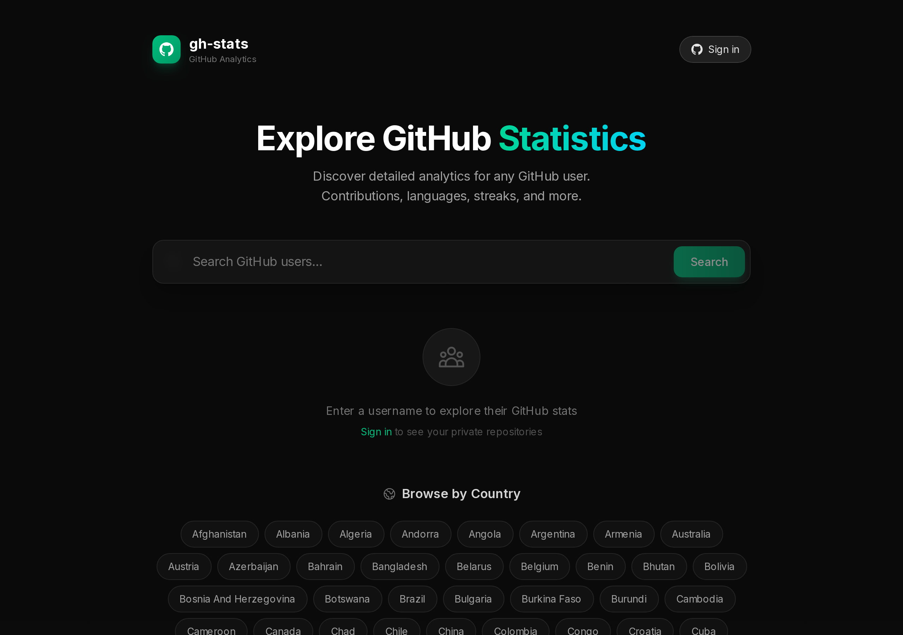

# GitHub Stats

GitHub analytics dashboard. [ghstats.fun](https://ghstats.fun)



## What GitHub doesn't show

- Contribution streaks (current and longest)
- Language usage across all repositories
- Commits from all repositories in one list
- Country rankings by contributions
- Everything on one page

## Data Source

All data comes from the GitHub API.

## Setup

Create `.env` with GitHub credentials:

```bash
GITHUB_TOKEN=xxx              # Personal access token from https://github.com/settings/tokens
GITHUB_CLIENT_ID=xxx          # OAuth app from https://github.com/settings/developers
GITHUB_CLIENT_SECRET=xxx
```

## Run

```bash
docker compose --profile dev up   # development
docker compose --profile prod up  # production
```
